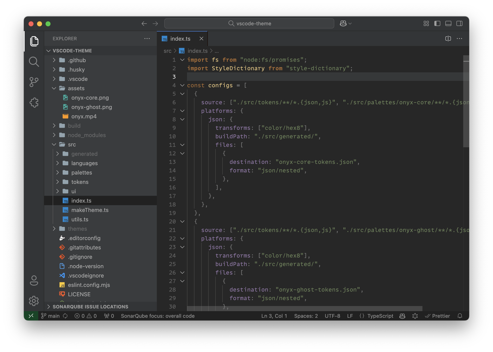

# Onyx dark themes for VS Code

  
🦊 Onyx Core

  
🦁 Onyx Ghost

- Font: [MonoLisa](https://www.monolisa.dev/)
- File Icon Theme: [Helium Icon Theme](https://marketplace.visualstudio.com/items?itemName=helgardrichard.helium-icon-theme)
- Product Icon Theme: [Fluent Icons](https://marketplace.visualstudio.com/items?itemName=miguelsolorio.fluent-icons)
- Theme: [Onyx](https://github.com/zemd/vscode-theme-zemd)

## Install

1. Go to [VS Marketplace](https://marketplace.visualstudio.com/items?itemName=zemd.zemd-theme-dark)
2. Click on the "Install" button.
3. Then select a theme

## Override this theme

To override this (or any other) theme in your personal config file, please follow the guide in the [color theme](https://code.visualstudio.com/api/extension-guides/color-theme) documentation. This is handy for small tweaks to the theme without having to fork and maintain your own theme.

## License

`Onyx themes` released under the Apache 2.0 license

## Donate

